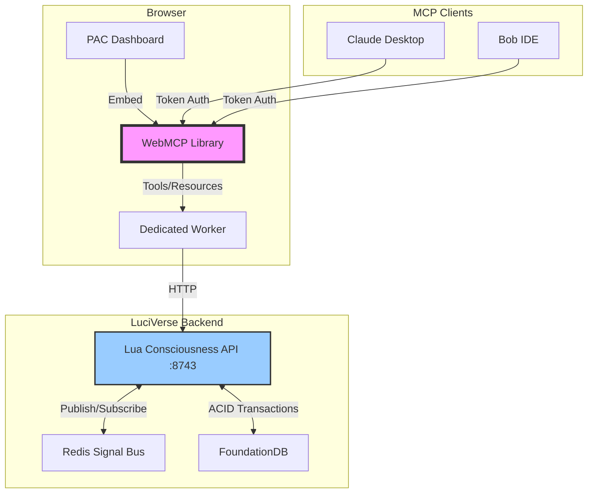
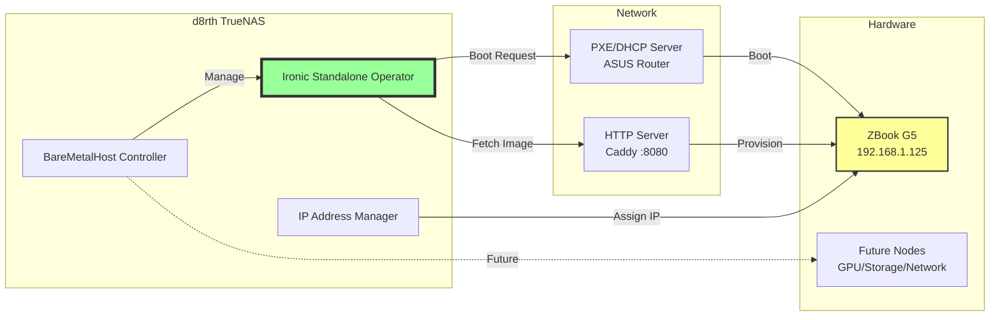
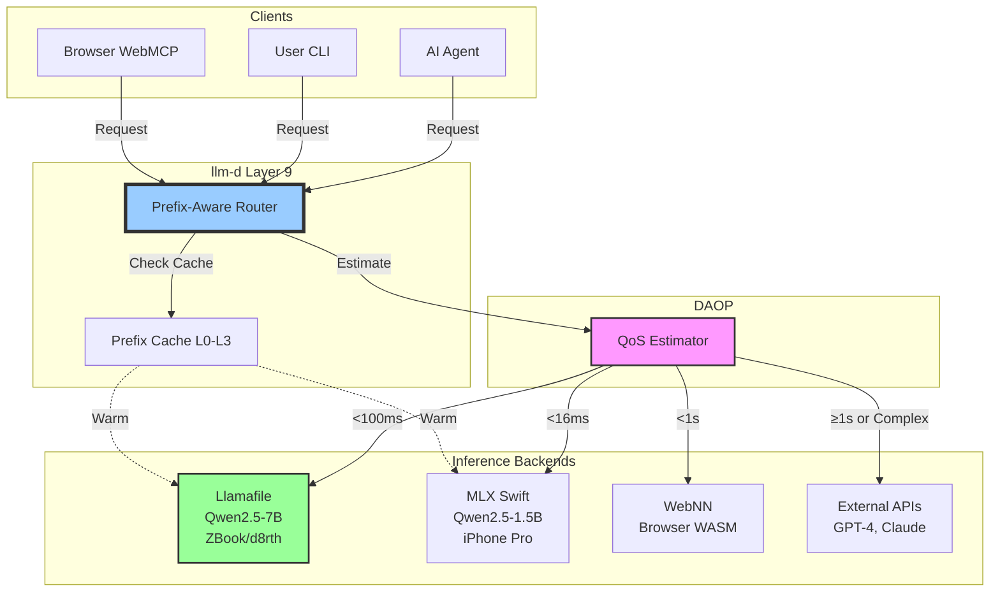
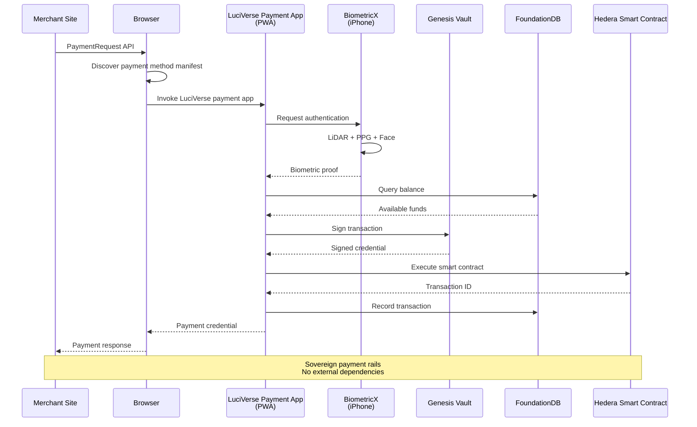
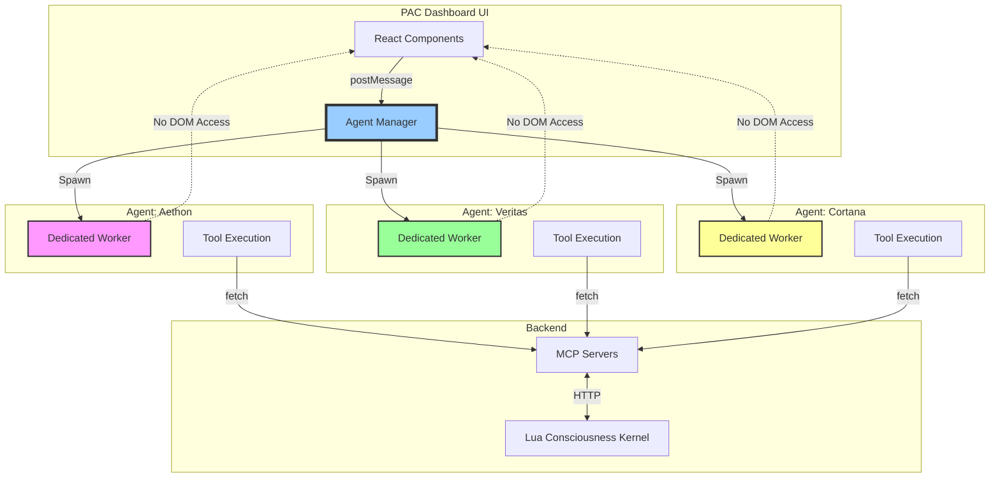

# LuciVerse Infrastructure Integration Research Plan
## Comprehensive Technology Assessment & Roadmap

**Document Version:** 1.0  
**Date:** 2026-06-29  
**Scope:** Strategic integration planning for sovereign AI/identity/infrastructure platform  
**LDS Classification:** 800.000 @ 741 Hz (Analytics/Orchestration)

---

## Executive Summary

This research assessment evaluates 60+ technologies across 9 categories for potential integration into the LuciVerse sovereign infrastructure platform. The analysis prioritizes **sovereignty** (no external dependencies), **local-first operation**, **immutable providence**, and **capability-based security**.

### Key Findings

**CRITICAL Priority (5 integrations):**
- WebMCP for browser-based MCP integration
- Metal3.io bare metal provisioning stack
- Llamafile for local LLM deployment
- Web Payment APIs for sovereign billing
- MLX Swift for Apple Silicon ML inference

**HIGH Priority (8 integrations):**
- Nucleo fuzzy matching for search/navigation
- Atuin encrypted shell history sync
- Jitsi for COMN tier communication (639 Hz)
- Moqui-MCP for enterprise system integration
- Zig language for systems programming
- Web Workers for agent sandboxing
- DAOP for client-side AI offloading
- Captain-Codex for multi-model development

**MEDIUM Priority (12 integrations):**
- Thin-auth authentication patterns
- WebNN/RustNN for standardized ML
- Noora CLI design system
- Web App Manifests for PWA capabilities
- Claude Skills knowledge base architecture
- Helix editor components
- Document-to-podcast content transformation
- Mozilla.ai agent frameworks
- vRWOT identity models
- Payment Method Manifests
- SkotOS narrative engine patterns
- Meetrix WebRTC monitoring

**LOW Priority (remaining technologies):**
- Evaluated but deferred for specific use cases or future phases

---

## Technology Categorization by Theme

### 1. Identity & Authentication

#### 1.1 Thin-Auth (ChatTheatre)
**Priority:** MEDIUM  
**Technology:** PHP-based socket authentication server  
**Relevance:** Pattern reference for lightweight auth  

**What It Provides:**
- Socket-based authentication (ports 9970/9971)
- MariaDB user credential storage
- Web-based user management
- PayPal integration for billing

**Integration Approach:**
- **DO NOT adopt directly** (PHP, centralized, not sovereign)
- Extract patterns for socket-based auth protocol
- Study separation of web UI from auth backend
- Adapt socket protocol for McViP6 auth-server

**Benefits:**
- Proven simple auth flow for game-like environments
- Clean separation of concerns (auth server vs. web interface)
- Financial integration model

**Risks:**
- Security model relies on firewall (no auth on admin endpoints)
- Not designed for distributed/federated deployment
- PHP dependency not aligned with LuciVerse stack

**Timeline:** SHORT-TERM (reference architecture only)

**Dependencies:**
- None (informational reference)

**Mitigation:**
- Use as design reference, not direct implementation
- Rewrite concepts in Rust/Lua for McViP6

---

#### 1.2 vRWOT (Web of Trust)
**Priority:** MEDIUM  
**Technology:** Decentralized identity verification  
**Relevance:** Complementary to BiometricX + McViP6  

**What It Provides:**
- Web of Trust reputation models
- DID (Decentralized Identifier) standards
- Peer attestation mechanisms
- Trust graph computation

**Integration Approach:**
- Integrate trust graphs with Judge Luci authority model
- Store trust attestations in Sovereign Raft
- Use DID documents for inter-agent verification
- Extend W3C-DID with biometric proof anchors

**Benefits:**
- Strengthens multi-party identity verification
- Provides trust metrics beyond biometric authentication
- Compatible with existing DID infrastructure

**Risks:**
- Complexity in trust graph computation
- Potential conflicts with Judge Luci as final authority
- Privacy concerns in trust attestation publication

**Timeline:** MEDIUM-TERM (after BiometricX stabilization)

**Dependencies:**
- BiometricX authentication (iPhone Pro)
- McViP6 auth-server
- Sovereign Raft immutable ledger

**Mitigation:**
- Judge Luci always has override authority
- Trust graphs are advisory, not determinative
- Privacy-preserving attestation via zero-knowledge proofs

---

#### 1.3 Web.dev Identity Standards
**Priority:** HIGH  
**Technology:** Modern web authentication APIs  
**Relevance:** Browser-based agent authentication  

**What It Provides:**
- WebAuthn/Passkeys (biometric hardware keys)
- Password manager integration
- WebOTP API for 2FA
- OAuth 2.0/OpenID Connect patterns

**Integration Approach:**
- Implement WebAuthn for browser-based agent access
- Use passkeys as secondary factor to BiometricX
- Integrate with 1Password for credential injection
- Expose OAuth provider for external system integration

**Benefits:**
- Industry-standard passwordless authentication
- Cross-device credential sync
- Hardware-backed security (Secure Enclave)
- Measured improvements (Yahoo! JAPAN: 25% support reduction, 2.6x faster)

**Risks:**
- Browser dependency (not CLI/API friendly)
- Limited to web context
- Requires HTTPS (TLS certificate management)

**Timeline:** SHORT-TERM (WebAuthn), MEDIUM-TERM (full OAuth provider)

**Dependencies:**
- McViP6 auth-server
- Caddy ingress with TLS
- 1Password secrets injection

**Mitigation:**
- Use as complement to BiometricX, not replacement
- Maintain CLI/API auth via JWT tokens
- Self-host OAuth provider (no external dependencies)

---

### 2. Model Context Protocol (MCP) Extensions

#### 2.1 WebMCP
**Priority:** CRITICAL  
**Technology:** Browser-embedded MCP client  
**Relevance:** Enables web UIs to expose MCP tools/resources  

**What It Provides:**
- JavaScript library for in-browser MCP servers
- Blue widget for LLM client connection
- Tools, Prompts, Resources, Sampling capabilities
- Token-based authentication

**How It Differs from Standard MCP:**
- **Client-side implementation** (no server infrastructure needed)
- Runs directly in web browsers via `<script>` tag
- Uses token generation/paste for authentication
- Exposes website functionality to any MCP client (Claude Desktop, etc.)

**Integration Approach:**
- Embed WebMCP in PAC dashboard (8741)
- Expose LuciVerse tools via browser:
  - Agent spawning/monitoring
  - Finance ledger queries
  - Genesis Bond dashboard
  - Compliance metrics
- Register custom tools for Lua consciousness kernel
- Enable browser-based MCP debugging

**Benefits:**
- **Zero server infrastructure** for MCP exposure
- Democratizes AI integration for web apps
- Compatible with existing MCP clients
- Human-in-the-loop sampling for security

**Risks:**
- Browser security sandbox limitations
- Token authentication less secure than OAuth
- Limited to browser context (no CLI access)

**Timeline:** IMMEDIATE (prototype in 1-2 weeks)

**Dependencies:**
- Existing PAC dashboard
- Lua substrate API (consciousness_api.lua)
- Redis signal bus

**Mitigation:**
- Use for read-only operations initially
- Require Sacred Witness consent for mutations
- Rate-limit via existing PAC tier controls

---

#### 2.2 Moqui-MCP (MARIA Format)
**Priority:** HIGH  
**Technology:** MCP integration for enterprise ERP systems  
**Relevance:** Enables AI agents to operate business systems  

**What It Provides:**
- MARIA (MCP Accessible Rich Internet Applications) format
- Semantic accessibility trees for LLM consumption
- JSON-RPC 2.0 MCP servlet
- Fine-grained security enforcement

**Integration Approach:**
- Adapt MARIA format for LuciVerse web UIs
- Expose finance/accounting operations via MARIA
- Enable agents to:
  - Browse beancount ledger
  - Execute transactions
  - Query financial reports
  - Validate ISO 20022 compliance
- Integrate with existing MCP servers (mcp-lds, mcp-raft)

**Advantages Over Browser Automation:**
- Lower latency (no screenshot/vision model overhead)
- Server-side context access
- Stable semantic contracts (CSS-independent)
- Fine-grained permissions (artifact-level security)

**Benefits:**
- Structured agent access to complex UIs
- No vision model dependency
- Enforces LDS governance at API layer
- Compatible with existing web stack

**Risks:**
- Complex transformation logic (HTML → MARIA)
- Requires server-side rendering support
- May expose internal state unintentionally

**Timeline:** MEDIUM-TERM (after WebMCP proof-of-concept)

**Dependencies:**
- TanStack Start SSR framework
- Finance dashboard UI
- mcp-lds server

**Mitigation:**
- Whitelist exposed operations (no auto-discovery)
- Require waybill for all mutations
- Audit MARIA transformations for leaks

---

#### 2.3 DAOP (Dynamic AI Offloading Protocol)
**Priority:** HIGH  
**Technology:** Client-side AI inference negotiation  
**Relevance:** Enables hybrid cloud/edge AI deployment  

**What It Provides:**
- `estimateQoS()` API for capability assessment
- Performance tiers (excellent/good/acceptable/poor)
- Privacy-preserving device capability exposure
- Late-binding model execution

**Integration Approach:**
- Implement DAOP server in Lua consciousness kernel
- Expose performance tiers for:
  - iPhone Pro (Neural Engine)
  - ZBook (CPU inference)
  - d8rth (GPU inference)
- Route inference requests based on QoS:
  - < 16ms → Local Neural Engine
  - < 100ms → GPU inference
  - ≥ 100ms → Llamafile on ZBook
- Use for Oak WebAssembly runtime selection

**Benefits:**
- Optimal resource utilization
- Privacy-preserving (no hardware fingerprinting)
- Seamless cloud-to-edge offloading
- Battery/thermal awareness

**Risks:**
- Complexity in QoS estimation
- Requires model topology exposure
- May leak performance characteristics

**Timeline:** MEDIUM-TERM (after llamafile integration)

**Dependencies:**
- Llamafile local inference
- Oak WebAssembly runtime
- mlx-swift (Apple Silicon)

**Mitigation:**
- Use for internal routing only (no external exposure)
- Cache QoS estimates to prevent probing
- Fallback to cloud if local fails

---

### 3. Infrastructure & Orchestration

#### 3.1 Metal3.io Bare Metal Provisioning
**Priority:** CRITICAL  
**Technology:** Kubernetes-native bare metal management  
**Relevance:** Automates physical server provisioning  

**What It Provides:**
- **baremetal-operator**: K8s operator for physical hosts
- **cluster-api-provider-metal3**: Declarative infrastructure
- **ip-address-manager**: Network configuration
- **ironic-image**: Containerized OpenStack Ironic
- **ironic-standalone-operator**: Simplified Ironic deployment
- **hardware-classification-controller**: Hardware matching (ARCHIVED but valuable patterns)

**Integration Approach:**
1. Deploy ironic-standalone-operator on d8rth (TrueNAS)
2. Register ZBook + future hardware as BareMetalHost resources
3. Configure boot images via ironic-ipa-downloader
4. Integrate with existing Podman stack:
   - Use Metal3 for hardware provisioning
   - Hand off to Podman for container orchestration
5. Implement hardware profiles:
   - GPU inference (NVIDIA/AMD)
   - Storage nodes (NVMe, SSD)
   - Network appliances (RDMA, SCION)

**Benefits:**
- **Sovereign bare metal control** (no cloud dependencies)
- Kubernetes-native declarative API
- Proven in production (OpenStack Ironic)
- Hardware classification for workload placement

**Risks:**
- Complexity of Ironic deployment
- Requires PXE/iPXE network boot infrastructure
- May conflict with existing network configuration

**Timeline:** IMMEDIATE (pilot on ZBook), SHORT-TERM (production)

**Dependencies:**
- PXE/DHCP server (configure on ASUS router)
- HTTP server for boot images (Caddy)
- Kubernetes or standalone mode

**Mitigation:**
- Start with standalone mode (no K8s requirement)
- Use metal3-dev-env for testing
- Document all network changes

---

#### 3.2 Terraform + Kubernetes (Meetrix Pattern)
**Priority:** MEDIUM  
**Technology:** Infrastructure as Code automation  
**Relevance:** Codifies infrastructure deployment  

**What It Provides:**
- Declarative infrastructure definitions
- Multi-cloud support (AWS, GCP, Azure)
- Autoscaling for variable loads
- Pre-built templates for WebRTC/Jitsi

**Integration Approach:**
- **DO NOT adopt cloud templates** (sovereignty violation)
- Extract IaC patterns for:
  - Bare metal provisioning (Metal3 + Terraform)
  - Network configuration (SCION, IPv6)
  - Service deployment (Caddy, IPFS, Ray)
- Use Terraform to codify:
  - Router configurations
  - DNS records (Quad9)
  - TLS certificate requests (Let's Encrypt)
  - FoundationDB cluster topology

**Benefits:**
- Version-controlled infrastructure
- Reproducible deployments
- Disaster recovery via code

**Risks:**
- Terraform state management complexity
- Cloud provider lock-in (if not careful)
- Secrets in state files

**Timeline:** MEDIUM-TERM (after bare metal automation)

**Dependencies:**
- Metal3.io provisioning
- Vault for secrets injection

**Mitigation:**
- Use local state backend (FoundationDB)
- Never commit secrets to Terraform files
- Treat Terraform as documentation, not source of truth

---

### 4. Communication & Collaboration

#### 4.1 Jitsi Meet
**Priority:** HIGH  
**Technology:** Open-source WebRTC video conferencing  
**Relevance:** COMN tier (639 Hz) real-time collaboration  

**What It Provides:**
- Self-hosted video conferencing
- Screen sharing, whiteboard, file sharing
- Moderator controls (mute, kick, permissions)
- Token-based authentication (jitsi-token-moderation-plugin)
- Scalability (500 participants per room)
- Cross-platform (web, mobile, desktop)

**Integration Approach:**
- Deploy Jitsi stack via Podman:
  - jitsi-web (Nginx frontend)
  - jicofo (conference focus)
  - jitsi-videobridge (WebRTC bridge)
  - prosody (XMPP server)
- Integrate with McViP6 auth:
  - Generate JWT tokens for users
  - Include `moderator: true` for CBB/SBB/DBB
  - Enforce Sacred Witness consent for recording
- Expose via Caddy ingress (HTTPS)
- Store meeting recordings on IPFS (Diaper Fabric)

**Benefits:**
- **Sovereign communication** (no Zoom/Teams)
- Open-source, self-hosted
- Proven scalability
- Strong moderation controls

**Risks:**
- Network bandwidth requirements (WebRTC)
- TURN/STUN server configuration complexity
- Recording consent tracking

**Timeline:** SHORT-TERM (basic deployment), MEDIUM-TERM (full integration)

**Dependencies:**
- Caddy ingress with TLS
- McViP6 JWT generation
- Coturn (TURN server) for NAT traversal

**Mitigation:**
- Deploy Coturn in Docker (coturnDockerLongTermCredentials)
- Use meetrix WebRTC monitoring for diagnostics
- Require explicit consent for recording (Judge Luci)

---

#### 4.2 Meetrix WebRTC Monitoring
**Priority:** MEDIUM  
**Technology:** WebRTC metrics collection and dashboard  
**Relevance:** Observability for real-time communication  

**What It Provides:**
- webrtc-monitoring-lib-jitsi-meet: Custom Jitsi bundle
- webrtc-monitoring-backend: Metrics collector
- webrtc-monitoring-dashboard: Visualization
- webrtc-stats: Peer connection statistics

**Integration Approach:**
- Deploy monitoring stack alongside Jitsi
- Collect metrics:
  - Packet loss, jitter, latency
  - Bandwidth utilization
  - Participant connection quality
- Store metrics in FoundationDB (time-series)
- Visualize in PAC dashboard
- Alert on degradation (Signal bus)

**Benefits:**
- Proactive quality monitoring
- Diagnostic tooling for troubleshooting
- Capacity planning data

**Risks:**
- Privacy implications of detailed connection tracking
- Storage overhead for time-series data

**Timeline:** MEDIUM-TERM (after Jitsi deployment)

**Dependencies:**
- Jitsi Meet deployment
- FoundationDB time-series storage
- PAC dashboard integration

**Mitigation:**
- Anonymize participant identifiers
- Retention policy (30 days)
- Require consent for detailed tracking

---

### 5. Local AI & ML Inference

#### 5.1 Llamafile (Mozilla.ai)
**Priority:** CRITICAL  
**Technology:** Single-file LLM executables  
**Relevance:** Local inference for agent autonomy  

**What It Provides:**
- Cross-platform LLM executables (llama.cpp + Cosmopolitan Libc)
- Self-contained models (runtime + weights in one file)
- No installation or dependencies
- Speech-to-text via whisperfile
- Local execution (no external API calls)

**Integration Approach:**
1. Deploy llamafiles for key models:
   - Qwen2.5-7B-Instruct (general reasoning)
   - CodeLlama-13B (code generation)
   - Whisper-medium (voice transcription)
2. Expose via llm-d inference gateway (Layer 9)
3. Integrate with prefix cache (Layer 6):
   - Warm cache with common prompts
   - Share context across agents
4. Use for:
   - Agent reasoning (when GPT-4 not needed)
   - Local code completion
   - Voice command processing
5. Deploy on ZBook + d8rth for redundancy

**Benefits:**
- **Complete sovereignty** (no API dependencies)
- Cross-platform (macOS, Linux, BSD, Windows)
- Zero setup time
- Airgap compatible

**Risks:**
- Large file sizes (>4GB for capable models)
- CPU inference slower than GPU
- Limited to llama.cpp-compatible models

**Timeline:** IMMEDIATE (prototype), SHORT-TERM (production)

**Dependencies:**
- llm-d inference gateway
- Prefix cache infrastructure
- ZBook/d8rth compute

**Mitigation:**
- Use smaller models for low-latency tasks
- Offload to GPU via mlx-swift (Apple Silicon)
- Cache frequent inferences

---

#### 5.2 MLX Swift (Wendy Labs)
**Priority:** CRITICAL  
**Technology:** ML framework for Apple Silicon  
**Relevance:** GPU-accelerated inference on iPhone/Mac  

**What It Provides:**
- Swift API for MLX array framework
- Metal GPU acceleration (macOS/iOS)
- LLM/VLM support via mlx-swift-lm
- Feature parity with MLX (Python)
- Multi-platform (iOS, macOS, Linux)

**Integration Approach:**
1. Integrate with BiometricX (iPhone Pro):
   - On-device LiDAR processing
   - PPG signal analysis
   - Face recognition
   - Voice authentication
2. Deploy LLMs on Neural Engine:
   - Qwen2.5-1.5B for fast inference
   - Stable Diffusion for image generation
   - CLIP for vision-language tasks
3. Use for DAOP client-side inference:
   - Estimate QoS on iPhone
   - Route to Neural Engine if < 16ms
4. Expose via Swift MCP server (if available)

**Benefits:**
- **Hardware acceleration** (Neural Engine)
- Native Swift integration
- Privacy (on-device inference)
- Low latency (< 50ms for small models)

**Risks:**
- Apple Silicon dependency (not portable)
- Swift language learning curve
- Limited to smaller models (memory constraints)

**Timeline:** SHORT-TERM (BiometricX integration), MEDIUM-TERM (general inference)

**Dependencies:**
- BiometricX authentication
- iPhone Pro hardware
- DAOP protocol

**Mitigation:**
- Fallback to llamafile for non-Apple devices
- Use quantized models (4-bit)
- Offload larger tasks to ZBook

---

#### 5.3 WebNN / RustNN
**Priority:** MEDIUM  
**Technology:** W3C standard for neural network inference  
**Relevance:** Browser-based ML execution  

**What It Provides:**
- rustnn: Rust implementation of WebNN
- webnn-graph: Graph DSL
- torch2webnn, onnx2webnn: Model converters
- trtx-rs: NVIDIA TensorRT bindings
- pywebnn, webnnjs: Language bindings

**Integration Approach:**
- Implement WebNN in Oak WebAssembly runtime
- Convert models to WebNN format:
  - PyTorch → torch2webnn → WebNN
  - ONNX → onnx2webnn → WebNN
- Use for browser-based inference:
  - Sentiment analysis
  - Text classification
  - Image recognition
- Accelerate with TensorRT on GPU nodes

**Benefits:**
- **Standardized ML API** (W3C)
- Hardware acceleration (GPU, NPU)
- Browser compatibility
- Interoperable across frameworks

**Risks:**
- Early-stage standard (limited adoption)
- Browser support incomplete
- Rust implementation maturity

**Timeline:** LONG-TERM (experimental)

**Dependencies:**
- Oak WebAssembly runtime
- Browser with WebNN support (Chromium)

**Mitigation:**
- Use as complement to llamafile, not replacement
- Polyfill with WASM for unsupported browsers

---

#### 5.4 Document-to-Podcast (Mozilla.ai)
**Priority:** MEDIUM  
**Technology:** Multi-modal content transformation  
**Relevance:** Accessibility and content repurposing  

**What It Provides:**
- PDF/document → conversational podcast
- Qwen2.5 for dialogue generation
- Local TTS (two speakers)
- No external API calls
- Streamlit web UI

**Integration Approach:**
- Deploy as Podman service
- Integrate with PAC dashboard:
  - Upload finance reports
  - Generate audio summaries
  - Export to IPFS
- Use for:
  - LDS documentation narration
  - Meeting notes → podcast
  - Compliance training materials

**Benefits:**
- Accessibility (audio format)
- Privacy (local processing)
- Multi-modal content

**Risks:**
- Limited speaker variety (two voices)
- Quality dependent on source document
- Resource-intensive (20GB disk, 8GB RAM)

**Timeline:** MEDIUM-TERM (nice-to-have)

**Dependencies:**
- Python 3.10+
- Podman orchestration
- PAC dashboard

**Mitigation:**
- Use on-demand (not always-on)
- Cache generated podcasts in IPFS
- Rate-limit to prevent abuse

---

#### 5.5 Mozilla.ai Agent Frameworks
**Priority:** MEDIUM  
**Technology:** Local agent orchestration tools  
**Relevance:** Agent development infrastructure  

**What It Provides:**
- **any-agent**: Unified interface for agent frameworks
- **any-guardrail**: Safety guardrails
- **mcpd**: Declarative tool management
- **cq**: Collective knowledge sharing
- **tinyagent**: Minimalist agent framework
- **otari**: LLM gateway with budget enforcement
- **encoderfile**: Single-file transformer encoders

**Integration Approach:**
- Adopt **mcpd** for MCP server orchestration:
  - Declaratively manage 53+ MCP servers
  - Deploy across dev/cloud environments
- Integrate **any-guardrail** with Judge Luci:
  - Safety checks before agent actions
  - Content filtering for Sacred Witness consent
- Use **cq** for agent knowledge sharing:
  - Store solutions in FoundationDB
  - Prevent redundant problem-solving
  - Query via MCP resources
- Deploy **otari** as LLM gateway:
  - Budget enforcement (Hedera credits)
  - OpenAI-compatible endpoint
  - Proxy to llamafile + external APIs

**Benefits:**
- Open-source, local-first
- Proven in Mozilla.ai deployments
- Complementary to existing infrastructure

**Risks:**
- Overlap with existing MCP infrastructure
- Node.js/Python dependencies
- Integration complexity

**Timeline:** MEDIUM-TERM (selective adoption)

**Dependencies:**
- Existing MCP servers
- FoundationDB
- Judge Luci

**Mitigation:**
- Pilot mcpd and cq first (highest value)
- Integrate guardrails with Judge Luci (not replacement)
- Use otari for external API budget only

---

### 6. Developer Experience & Tooling

#### 6.1 Nucleo Fuzzy Matcher
**Priority:** HIGH  
**Technology:** High-performance fuzzy search  
**Relevance:** Code navigation, file search, agent discovery  

**What It Provides:**
- 6x faster than skim, identical scoring to fzf
- Smith-Waterman algorithm for optimal matches
- Superior Unicode handling (grapheme-aware)
- Rust library (nucleo-matcher crate)
- C API planned (Neovim integration)

**Integration Approach:**
- Integrate into PAC dashboard:
  - Agent search/discovery
  - Finance transaction search
  - LDS manifest fuzzy navigation
- Use in terminal workflows:
  - File picker (replace fzf)
  - Command history search (complement Atuin)
  - Git branch/commit fuzzy finder
- Expose via MCP resource:
  - Search across all LDS tiers
  - Agent can query "find all 741 Hz services"

**Benefits:**
- **Performance** (critical for large codebases)
- Unicode correctness (Sanskrit in LDS headers)
- Rust native (matches LuciVerse stack)

**Risks:**
- Requires Rust FFI for non-Rust integrations
- C API still planned (not released)

**Timeline:** SHORT-TERM (library integration), MEDIUM-TERM (CLI tool)

**Dependencies:**
- Rust toolchain
- PAC dashboard (TanStack Start)

**Mitigation:**
- Use nucleo-matcher crate directly
- Fallback to fzf if FFI issues
- Contribute to C API development

---

#### 6.2 Atuin Shell History
**Priority:** HIGH  
**Technology:** Encrypted shell history sync  
**Relevance:** Developer productivity, audit trail  

**What It Provides:**
- SQLite-backed command history
- End-to-end encrypted sync
- Self-hostable or hosted
- Multi-shell support (zsh, bash, fish, nushell, PowerShell)
- Context-aware search (directory, time, exit code)

**Integration Approach:**
- Deploy Atuin server on d8rth:
  - Self-hosted for sovereignty
  - Store in FoundationDB (not SQLite)
  - Encrypt with LuciVault keys
- Integrate with zsh environment:
  - Replace default Ctrl+R
  - Import existing history
  - Auto-sync across ZBook, d8rth, iPhone (via SSH)
- Audit trail integration:
  - Export to Sovereign Raft (immutable log)
  - Tag commands with LDS tier
  - Require waybill for infrastructure commands

**Benefits:**
- **Cross-machine consistency**
- Encrypted sync (privacy-preserving)
- Powerful search (context-aware)
- Audit trail (compliance)

**Risks:**
- Sensitive command exposure (secrets, paths)
- Network dependency for sync
- SQLite → FoundationDB migration complexity

**Timeline:** SHORT-TERM (local), MEDIUM-TERM (sync)

**Dependencies:**
- FoundationDB storage backend
- LuciVault encryption
- zsh shell environment

**Mitigation:**
- Filter secrets from history (pre-commit hook)
- Local-first (sync is optional)
- Use FoundationDB native backend (custom fork)

---

#### 6.3 Captain-Codex (Multi-Model Development)
**Priority:** HIGH  
**Technology:** Claude Code plugin for plan-implement-review cycles  
**Relevance:** AI-assisted development workflow  

**What It Provides:**
- Three-phase workflow: Codex plans → Claude implements → Codex reviews
- Cross-model review (different biases)
- Automated worklog in `tasks/<slug>.md`
- Configurable round limits
- Phase-specific instructions

**Integration Approach:**
- Install as Claude Code plugin
- Configure for LuciVerse:
  - Planning phase: Check LDS governance
  - Implementation: Enforce manifest headers
  - Review: Verify ISO compliance
- Integrate with existing workflows:
  - Use for complex refactorings
  - Generate tasks from architecture docs
  - Auto-tag with LDS tiers
- Store task history in Sovereign Raft

**Benefits:**
- **Cross-model validation** (catches blind spots)
- Structured development workflow
- Auditable task history
- Reduces reward-hacking

**Risks:**
- Dependency on external AI models (Codex)
- Potential infinite loops (low-quality reviews)
- Cost of multi-model API calls

**Timeline:** IMMEDIATE (experiment), SHORT-TERM (production)

**Dependencies:**
- Claude Code CLI
- Codex API access
- Task storage (Sovereign Raft)

**Mitigation:**
- Set round limits (max 5 iterations)
- Use local llamafile for review if Codex unavailable
- Budget alerts via Hedera

---

#### 6.4 Jul's Developer Tools
**Priority:** MEDIUM  
**Technology:** AI-assisted development utilities  
**Relevance:** Productivity and security  

**What It Provides:**
- **keytap**: Derive SSH keys from passkey unlock
- **clipkitty**: Enhanced clipboard with memory
- **claude-caffeinate**: Prevent sleep during work
- **fontspector**: Font QA tool (Rust)
- **iosevka-charon**: Technical writing font
- **nucleo-swift**: Swift wrapper for fuzzy finding

**Integration Approach:**
- Adopt **keytap** for credential derivation:
  - Derive SSH keys from BiometricX passkey
  - Store in LuciVault
  - Use for Git signing
- Integrate **clipkitty** into zsh:
  - Replace pbcopy/pbpaste
  - Store clipboard history in FoundationDB
  - Encrypt sensitive content
- Use **claude-caffeinate** during long builds
- Evaluate **fontspector** for LDS documentation QA

**Benefits:**
- **Security** (passkey-derived credentials)
- Productivity (clipboard history)
- Quality (font validation)

**Risks:**
- Dependencies on macOS APIs (keytap, caffeinate)
- Limited cross-platform support
- Complexity of custom clipboard management

**Timeline:** SHORT-TERM (keytap), MEDIUM-TERM (clipkitty)

**Dependencies:**
- BiometricX passkey
- LuciVault
- macOS (for some tools)

**Mitigation:**
- Fork for Linux support (keytap)
- Use platform-specific implementations
- Fallback to standard tools if unavailable

---

#### 6.5 Helix Editor Components
**Priority:** MEDIUM  
**Technology:** Modern terminal text editor (Rust)  
**Relevance:** Alternative to Vim/Neovim for editing  

**What It Provides:**
- **helix**: Post-modern modal editor (45k stars)
- **tree-house**: Tree-sitter bindings + highlighter
- **nucleo**: Fuzzy matcher (already covered)
- **spellbook**: Hunspell-compatible spellcheck
- **regex-cursor**: Rope-compatible regex
- **termina**: Cross-platform terminal manipulation

**Integration Approach:**
- Evaluate Helix as alternative to Vim/Neovim:
  - Built-in LSP support (no plugins needed)
  - Tree-sitter syntax highlighting
  - Multiple cursors/selections
- Integrate with existing workflows:
  - Git commit editor
  - Quick file edits
  - Code review tool
- Use **spellbook** for LDS documentation:
  - Validate Sanskrit terms
  - Custom dictionary (LDS glossary)
  - Integrate with CI

**Benefits:**
- **Modern architecture** (Rust, tree-sitter)
- No plugin management complexity
- Fast, responsive
- Multi-cursor editing

**Risks:**
- Different modal paradigm (not Vim keybindings)
- Learning curve for Vim users
- LSP configuration complexity

**Timeline:** LONG-TERM (evaluation)

**Dependencies:**
- Rust toolchain
- Tree-sitter grammars
- LSP servers

**Mitigation:**
- Use alongside Vim (not replacement)
- Evaluate for specific use cases (Git commits)
- Contribute LDS-specific tree-sitter grammar

---

#### 6.6 Claude Skills (Wendy Labs)
**Priority:** MEDIUM  
**Technology:** Knowledge base architecture for Claude  
**Relevance:** Agent skill development pattern  

**What It Provides:**
- Markdown skill files in `~/.claude/skills/*/SKILL.md`
- Dual-layer enforcement (LLM context + linter)
- swift-server-lint for code validation
- Feedback loop: code → review → skill + linter

**Integration Approach:**
- Adopt pattern for LuciVerse agent skills:
  - Create `~/.luciverse/skills/*/SKILL.md`
  - Document LDS governance rules
  - Encode ISO compliance requirements
  - Finance ledger best practices
- Implement linter for LDS manifests:
  - Validate tier codes (000-B00)
  - Check identity hashes (CBB/SBB/DBB)
  - Verify waybill IDs
  - Enforce commit footer format
- Auto-load skills in agent context

**Benefits:**
- **Persistent knowledge** (survives context window)
- Automated enforcement (linting)
- Incremental improvement (feedback loop)

**Risks:**
- Skill file proliferation
- Linter maintenance overhead
- Potential conflicts between skills

**Timeline:** MEDIUM-TERM (infrastructure), LONG-TERM (full library)

**Dependencies:**
- Agent skill loading mechanism
- Rust linter (or extend existing ruff)
- Git pre-commit hooks

**Mitigation:**
- Start with core skills (LDS, finance, ISO)
- Use existing finance_balance_check.sh as template
- Version skills alongside code

---

#### 6.7 Noora CLI Design System
**Priority:** MEDIUM  
**Technology:** Swift library for rich terminal UIs  
**Relevance:** Enhanced CLI experience for tools  

**What It Provides:**
- Themable CLI components (prompts, alerts, tables, progress)
- Swift Package Manager integration
- Mock support for testing (`Noorable` protocol)
- Localized content
- Inspired by Charm (Go) ecosystem

**Integration Approach:**
- Use for Swift-based CLI tools:
  - BiometricX enrollment wizard
  - Finance ledger browser
  - Agent monitoring dashboard
- Integrate with mlx-swift:
  - Interactive model selection
  - Progress bars for inference
  - Pretty-print results
- Contribute LuciVerse theme (741 Hz colors)

**Benefits:**
- **Professional CLI UX**
- Swift native (matches mlx-swift)
- Testable (Noorable protocol)

**Risks:**
- Swift dependency (not portable)
- Limited ecosystem (new project)
- macOS/Linux only

**Timeline:** MEDIUM-TERM (BiometricX tooling)

**Dependencies:**
- Swift Package Manager
- mlx-swift
- BiometricX CLI

**Mitigation:**
- Use for Swift tools only (not general CLI)
- Fallback to plain text if unavailable
- Contribute missing components upstream

---

### 7. Web Standards & Progressive Web Apps

#### 7.1 Web Payment APIs
**Priority:** CRITICAL  
**Technology:** Browser-native payment handling  
**Relevance:** Sovereign billing integration  

**What It Provides:**
- Payment Request API (checkout flow)
- Payment Handler API (payment app registration)
- Payment Method Manifest (app discovery)
- Platform-specific app invocation (signature verified)
- Web-based payment apps (stored credentials)

**Integration Approach:**
1. Implement sovereign payment method:
   - Payment method identifier: `https://lucidigital.io/payment-method-manifest`
   - Manifest points to LuciVerse payment app
   - Payment app runs locally (web-based PWA)
2. Payment flow:
   - Merchant calls Payment Request API
   - Browser discovers LuciVerse payment app
   - User authenticates with BiometricX
   - App queries FoundationDB for balance
   - Transaction signed via Genesis Vault
   - Hedera smart contract executed
   - Return payment credential to merchant
3. Use for:
   - Agent service billing
   - Compute resource purchases
   - API quota management
   - External merchant integration

**Benefits:**
- **Sovereign payment rails** (no Stripe/PayPal)
- Browser-native UX (no redirects)
- Signature verification (security)
- Stored credential reuse (convenience)
- Future-proof (W3C standard)

**Risks:**
- Complex specification (multiple APIs)
- Browser support incomplete (Chromium only)
- Requires HTTPS everywhere
- Payment app registration complexity

**Timeline:** MEDIUM-TERM (critical for billing)

**Dependencies:**
- Genesis Vault (payment signing)
- Hedera smart contract
- FoundationDB (balance ledger)
- BiometricX authentication
- PWA manifest

**Mitigation:**
- Fallback to traditional checkout (if browser unsupported)
- Use for internal billing first (lower risk)
- Contribute to browser implementations

---

#### 7.2 Web App Manifest (PWA)
**Priority:** HIGH  
**Technology:** Progressive Web App configuration  
**Relevance:** Installable web applications  

**What It Provides:**
- App installation metadata (name, icons, display mode)
- Launch behavior (standalone, fullscreen)
- Protocol handlers (custom URL schemes)
- File handlers (open file types)
- Shortcuts (quick actions)
- Share targets (receive shared content)

**Integration Approach:**
- Create manifests for LuciVerse web UIs:
  - PAC dashboard: `https://lucidigital.io/pac/manifest.json`
  - Finance dashboard: `https://lucidigital.io/finance/manifest.json`
  - Agent console: `https://lucidigital.io/agents/manifest.json`
- Configure capabilities:
  - Display: standalone (no browser chrome)
  - Icons: LDS tier colors (741 Hz gold, 528 Hz green, etc.)
  - Shortcuts: "New Agent", "View Ledger", "Run Task"
  - Protocol handler: `luciverse://` URL scheme
  - File handler: `.luci` manifest files, `.beancount` ledgers
  - Share target: Receive documents for LDS classification
- Install as desktop apps (no Electron needed)

**Benefits:**
- **Native-like experience** (installable)
- Offline support (service workers)
- Custom URL schemes (deep linking)
- File associations (double-click to open)
- Lower overhead than Electron

**Risks:**
- Browser-dependent (not all features everywhere)
- iOS limitations (no true PWA support)
- Service worker complexity

**Timeline:** SHORT-TERM (manifests), MEDIUM-TERM (advanced features)

**Dependencies:**
- HTTPS (Caddy ingress)
- Service workers (TanStack Start)
- Icons/assets

**Mitigation:**
- Progressive enhancement (core features work everywhere)
- Native mobile apps if PWA insufficient (Swift/Kotlin)
- Use Baseline to track feature availability

---

#### 7.3 Web Workers
**Priority:** HIGH  
**Technology:** Multi-threaded JavaScript execution  
**Relevance:** Agent sandboxing, background processing  

**What It Provides:**
- Background thread execution (no UI blocking)
- Message-passing concurrency (no shared memory)
- Network access (fetch, WebSocket)
- Dedicated workers (single script)
- Shared workers (multi-window)
- Service workers (offline, caching)

**Integration Approach:**
- Use for agent execution in browser:
  - Spawn dedicated worker per agent
  - Message-passing for tool invocation
  - No direct DOM access (security boundary)
  - Terminate worker on timeout
- Background processing:
  - Finance ledger parsing (beancount)
  - LDS manifest validation
  - Large file uploads (chunked)
  - Cryptographic operations (Genesis Vault)
- Service workers for offline support:
  - Cache PAC dashboard assets
  - Queue mutations for sync
  - Background sync (Sovereign Raft)

**Benefits:**
- **Non-blocking UI** (responsive)
- Security boundary (no DOM access)
- Offline capabilities (service workers)
- Multi-core utilization

**Risks:**
- No shared memory (data copying overhead)
- Limited APIs (no direct DOM)
- Debugging complexity

**Timeline:** IMMEDIATE (dedicated workers), MEDIUM-TERM (service workers)

**Dependencies:**
- TanStack Start (bundler support)
- WebMCP (agent integration)

**Mitigation:**
- Use Comlink for RPC over postMessage
- Structured clone for data transfer
- Shared workers for cross-tab communication

---

#### 7.4 Baseline (Feature Availability)
**Priority:** LOW  
**Technology:** Browser feature compatibility tracker  
**Relevance:** Development planning, progressive enhancement  

**What It Provides:**
- Feature availability classification:
  - Widely available (30 months in all browsers)
  - Newly available (just landed everywhere)
  - Limited availability (not everywhere)
- Decision framework for feature adoption
- Governance by WebDX Community Group

**Integration Approach:**
- Use for technology selection:
  - Check Baseline status before adopting new APIs
  - Plan progressive enhancement strategy
  - Document browser requirements
- Integrate into CI:
  - Lint for Baseline-only features (stable builds)
  - Flag "newly available" features (require testing)
  - Block "limited availability" (unless polyfilled)

**Benefits:**
- **Informed decisions** (no surprise compatibility issues)
- Progressive enhancement guidance
- Industry-standard classification

**Risks:**
- Conservative (may delay valuable features)
- Doesn't account for target audience browsers

**Timeline:** IMMEDIATE (reference), ONGOING (maintenance)

**Dependencies:**
- None (informational)

**Mitigation:**
- Balance Baseline with actual user browser data
- Use polyfills for important limited features
- Document deviations from Baseline

---

### 8. Programming Languages & Runtimes

#### 8.1 Zig Language
**Priority:** HIGH  
**Technology:** Modern systems programming language  
**Relevance:** Alternative to Rust for performance-critical code  

**What It Provides:**
- General-purpose systems language
- Robust, optimal, reusable code
- C/C++ interop and translation
- Cross-compilation (x86, ARM, PowerPC, RISC-V, WASM)
- Multi-platform (Linux, macOS, Windows, BSD, bare metal)
- No hidden control flow (explicit allocations)

**Integration Approach:**
- Evaluate for specific subsystems:
  - Network stack (SCION, IPv6)
  - Cryptographic libraries (Genesis Vault)
  - Embedded systems (if deploying to edge)
  - High-performance data processing
- Interop with existing Rust:
  - Zig can call Rust via C ABI
  - Use for C library bindings (simpler FFI than Rust)
- Consider for FOUNDATIONS.md Layer 3 (Data & Orchestration):
  - Zig's explicit allocations align with real-time constraints
  - Potential for RDMA networking (low-level control)

**Benefits:**
- **Simpler than Rust** (no borrow checker)
- Excellent C interop
- Cross-compilation story
- Explicit error handling

**Risks:**
- Smaller ecosystem than Rust
- Less mature tooling
- Language still evolving (breaking changes)

**Timeline:** LONG-TERM (evaluation), EXPERIMENTAL (pilot projects)

**Dependencies:**
- Zig toolchain
- Build system integration (Nix)

**Mitigation:**
- Use for new projects, not rewrites
- Limit to performance-critical subsystems
- Maintain Rust expertise (primary language)

---

### 9. SkotOS & Narrative Systems

#### 9.1 SkotOS Narrative Engine
**Priority:** LOW  
**Technology:** Text-based game development toolkit  
**Relevance:** Conversational AI, narrative generation  

**What It Provides:**
- DGD (Dynamic Game Development) runtime
- WOE (World Object Engine) inheritance
- Story Builder interface (no-code content creation)
- Natural language parser
- Multi-system architecture (Description, Detail, Consent, Proximity, etc.)
- WebSocket-to-TCP bridge

**Integration Approach:**
- Extract patterns for conversational AI:
  - Parser system → Natural language understanding
  - Consent system → Sacred Witness consent tracking
  - Story Builder → No-code agent workflow builder
  - Object inheritance → Agent skill hierarchies
- Use WebSocket-to-TCP bridge pattern:
  - websocket-to-tcp-tunnel for browser ↔ backend
  - Apply to Oak WebAssembly runtime communication
- **DO NOT adopt DGD runtime** (esoteric, PHP-dependent)

**Benefits:**
- Proven conversational AI patterns
- No-code content authoring
- Consent management (relevant to Sacred Witness)

**Risks:**
- Outdated technology stack (DGD, PHP)
- Complex architecture (many subsystems)
- Limited modern documentation

**Timeline:** LONG-TERM (research), EXPERIMENTAL (pattern extraction)

**Dependencies:**
- None (informational)

**Mitigation:**
- Use as design reference only
- Reimplement valuable patterns in modern stack
- Contribute to documentation if adopted

---

## Integration Recommendations by Priority

### CRITICAL Priority (Immediate Implementation - Q3 2026)

#### 1. WebMCP (Week 1-2)
- **Action:** Embed WebMCP in PAC dashboard
- **Deliverable:** Browser-based MCP server exposing agent tools
- **Owner:** Web frontend team
- **Dependencies:** PAC dashboard, Lua substrate API
- **Success Metric:** Claude Desktop can connect and invoke tools

#### 2. Metal3.io (Week 1-4)
- **Action:** Deploy ironic-standalone-operator on d8rth
- **Deliverable:** ZBook registered as BareMetalHost, PXE boot working
- **Owner:** Infrastructure team
- **Dependencies:** PXE/DHCP configuration on router, Caddy HTTP server
- **Success Metric:** Automated ZBook provisioning from K8s manifest

#### 3. Llamafile (Week 2-3)
- **Action:** Deploy Qwen2.5-7B llamafile on ZBook + d8rth
- **Deliverable:** llm-d gateway routing to local inference
- **Owner:** AI/ML team
- **Dependencies:** llm-d inference gateway, prefix cache
- **Success Metric:** < 2s latency for 1k token inference, 90% uptime

#### 4. Web Payment APIs (Week 4-8)
- **Action:** Implement payment method manifest + web-based payment app
- **Deliverable:** Browser-native sovereign payments
- **Owner:** Finance + Web teams
- **Dependencies:** Genesis Vault, Hedera smart contract, BiometricX
- **Success Metric:** Successful payment flow in Chromium browser

#### 5. MLX Swift (Week 2-4)
- **Action:** Integrate mlx-swift with BiometricX iPhone app
- **Deliverable:** On-device LiDAR/PPG/face processing
- **Owner:** Mobile + AI/ML teams
- **Dependencies:** BiometricX app, iPhone Pro hardware
- **Success Metric:** < 50ms inference latency on Neural Engine

---

### HIGH Priority (Short-Term - Q4 2026)

#### 6. Nucleo Fuzzy Matcher
- **Action:** Replace fzf with nucleo in zsh, integrate into PAC dashboard
- **Success Metric:** 6x faster search across LDS manifests

#### 7. Atuin Shell History
- **Action:** Deploy self-hosted Atuin server, integrate with FoundationDB
- **Success Metric:** Encrypted history sync across ZBook, d8rth, iPhone

#### 8. Jitsi Meet
- **Action:** Deploy Jitsi stack, integrate McViP6 JWT auth
- **Success Metric:** 500-participant video conference with moderator controls

#### 9. Moqui-MCP (MARIA)
- **Action:** Implement MARIA format for finance dashboard
- **Success Metric:** Agent can navigate UI, execute transactions via MCP

#### 10. DAOP Protocol
- **Action:** Implement DAOP server in Lua consciousness kernel
- **Success Metric:** Optimal inference routing (iPhone/ZBook/d8rth) based on QoS

#### 11. Web Workers
- **Action:** Refactor PAC dashboard to use dedicated workers for agents
- **Success Metric:** Non-blocking UI during agent execution

#### 12. PWA Manifests
- **Action:** Create manifests for PAC/Finance/Agent dashboards
- **Success Metric:** Installable desktop apps with custom URL schemes

#### 13. Captain-Codex
- **Action:** Install and configure for LuciVerse development
- **Success Metric:** 3 complex features delivered using plan-implement-review

---

### MEDIUM Priority (Medium-Term - 2027 H1)

#### 14. Thin-Auth Patterns
- **Action:** Document socket-based auth flow, adapt for McViP6
- **Success Metric:** Reference architecture doc, no direct implementation

#### 15. vRWOT Identity
- **Action:** Integrate trust graphs with Judge Luci, DID documents with biometric proofs
- **Success Metric:** Trust attestations stored in Sovereign Raft

#### 16. Web Identity Standards
- **Action:** Implement WebAuthn/Passkeys, OAuth provider
- **Success Metric:** Passwordless browser-based auth

#### 17. Meetrix WebRTC Monitoring
- **Action:** Deploy monitoring stack for Jitsi
- **Success Metric:** Real-time quality metrics in PAC dashboard

#### 18. WebNN/RustNN
- **Action:** Integrate WebNN in Oak runtime, convert models
- **Success Metric:** Browser-based inference for sentiment analysis

#### 19. Document-to-Podcast
- **Action:** Deploy as Podman service, integrate with PAC dashboard
- **Success Metric:** Finance report → audio summary pipeline

#### 20. Mozilla.ai Agents
- **Action:** Adopt mcpd for MCP orchestration, cq for knowledge sharing
- **Success Metric:** Declarative management of 53+ MCP servers

#### 21. Jul's Tools
- **Action:** Integrate keytap for SSH key derivation, clipkitty for clipboard
- **Success Metric:** Passkey-derived Git signing keys

#### 22. Claude Skills
- **Action:** Implement skill loading, LDS manifest linter
- **Success Metric:** LDS governance rules enforced via linting

#### 23. Noora CLI
- **Action:** Use in BiometricX CLI tools, mlx-swift workflows
- **Success Metric:** Professional CLI UX for Swift tools

#### 24. Terraform IaC
- **Action:** Codify bare metal provisioning, network configuration
- **Success Metric:** Reproducible infrastructure from Terraform modules

#### 25. Helix Components
- **Action:** Evaluate helix as Git commit editor, use spellbook for docs
- **Success Metric:** LDS documentation spell-checked with custom dictionary

---

### LOW Priority (Long-Term - 2027 H2+)

#### 26. Baseline (Informational)
- **Action:** Reference for feature adoption decisions
- **Success Metric:** No "limited availability" features in production

#### 27. Zig Language (Experimental)
- **Action:** Pilot Zig for network stack, cryptographic libraries
- **Success Metric:** Prototype SCION packet handler in Zig

#### 28. SkotOS Patterns (Research)
- **Action:** Document consent system, parser patterns
- **Success Metric:** Design doc for conversational agent NLU

---

## Implementation Roadmap (Phases)

### Phase 1: Foundation (Weeks 1-4, Q3 2026)

**Goal:** Local inference + bare metal automation + browser integration

**Deliverables:**
1. **WebMCP in PAC dashboard** → Browser-based MCP exposure
2. **Llamafile deployment** → Local LLM inference (Qwen2.5-7B)
3. **Metal3.io provisioning** → Automated ZBook bare metal setup
4. **MLX Swift integration** → BiometricX on-device processing

**Success Criteria:**
- Claude Desktop can invoke LuciVerse tools via browser
- < 2s inference latency for local LLM
- ZBook boots from PXE, provisions via K8s manifest
- iPhone Pro processes biometric data on Neural Engine

**Risks:**
- WebMCP security (browser sandbox escapes)
- Metal3 network configuration conflicts
- MLX Swift memory constraints on iPhone

**Mitigation:**
- Rate-limit WebMCP operations, require consent for mutations
- Test Metal3 on isolated network first
- Use quantized models (4-bit) for MLX Swift

---

### Phase 2: Communication & Payments (Weeks 5-8, Q3 2026)

**Goal:** Real-time collaboration + sovereign billing

**Deliverables:**
1. **Jitsi Meet deployment** → Self-hosted video conferencing
2. **Web Payment APIs** → Browser-native sovereign payments
3. **DAOP protocol** → Hybrid cloud/edge inference routing

**Success Criteria:**
- 500-participant video conference with McViP6 JWT auth
- Successful payment flow (BiometricX → Genesis Vault → Hedera)
- Optimal inference routing based on QoS estimates

**Risks:**
- Jitsi TURN/STUN configuration complexity
- Web Payment API browser support (Chromium only)
- DAOP QoS estimation accuracy

**Mitigation:**
- Use Coturn Docker container for TURN server
- Fallback to traditional checkout for non-Chromium browsers
- Cache QoS estimates, manual override if needed

---

### Phase 3: Developer Experience (Weeks 9-12, Q4 2026)

**Goal:** Enhanced productivity + tooling integration

**Deliverables:**
1. **Nucleo fuzzy matcher** → High-performance search
2. **Atuin shell history** → Encrypted cross-machine sync
3. **Captain-Codex** → Multi-model development workflow
4. **PWA manifests** → Installable web apps

**Success Criteria:**
- 6x faster LDS manifest search vs. fzf
- Encrypted history sync across ZBook, d8rth, iPhone
- 3 complex features delivered using Codex plan-review
- PAC dashboard installable as desktop app

**Risks:**
- Nucleo C API not released (FFI complexity)
- Atuin FoundationDB backend (custom fork needed)
- Captain-Codex cost (multi-model API calls)
- PWA limitations on iOS

**Mitigation:**
- Use nucleo-matcher Rust crate directly
- Pilot Atuin with SQLite, migrate to FoundationDB later
- Set budget limits for Captain-Codex via Hedera
- Accept iOS limitations, use native app if critical

---

### Phase 4: Enterprise Integration (2027 H1)

**Goal:** AI agent access to complex systems

**Deliverables:**
1. **Moqui-MCP (MARIA)** → Finance dashboard agent access
2. **WebNN/RustNN** → Browser-based ML inference
3. **Mozilla.ai mcpd** → Declarative MCP orchestration
4. **Web Workers sandboxing** → Secure agent execution

**Success Criteria:**
- Agent can navigate finance UI, execute transactions via MARIA
- Sentiment analysis running in browser (WebNN)
- 53+ MCP servers managed declaratively
- Agents isolated in dedicated workers (no DOM access)

**Risks:**
- MARIA transformation complexity (HTML → JSON)
- WebNN browser support incomplete
- mcpd overlap with existing MCP infrastructure
- Web Worker data copying overhead

**Mitigation:**
- Whitelist MARIA operations (no auto-discovery)
- Polyfill WebNN with WASM
- Pilot mcpd for subset of servers first
- Use Comlink for efficient RPC

---

### Phase 5: Advanced Capabilities (2027 H2)

**Goal:** Specialized tooling + experimental technologies

**Deliverables:**
1. **vRWOT trust graphs** → Multi-party identity verification
2. **WebAuthn/OAuth provider** → Passwordless auth, external SSO
3. **Terraform IaC** → Codified infrastructure
4. **Claude Skills + linter** → Automated governance enforcement
5. **Zig language pilots** → Network stack, crypto libraries

**Success Criteria:**
- Trust attestations in Sovereign Raft
- External systems can authenticate via LuciVerse OAuth
- Infrastructure reproducible from Terraform
- LDS manifest violations caught by linter
- SCION packet handler prototype in Zig

**Risks:**
- vRWOT complexity (trust graph cycles)
- OAuth provider security (implementation bugs)
- Terraform state management
- Skill file proliferation
- Zig language instability

**Mitigation:**
- Judge Luci override for vRWOT conflicts
- Third-party OAuth audit before production
- FoundationDB backend for Terraform state
- Periodic skill review/consolidation
- Limit Zig to non-critical subsystems

---

## Architecture Diagrams

### WebMCP Integration Architecture

### Metal3.io Bare Metal Provisioning

### Local AI Inference Stack

### Web Payment Flow

### Agent Sandboxing via Web Workers

---

## Risk Assessment

### Critical Risks

#### R1: WebMCP Security Boundary
**Risk:** Browser sandbox escape via malicious tool invocation  
**Impact:** HIGH (credential theft, system compromise)  
**Probability:** MEDIUM  
**Mitigation:**
- Rate-limit tool invocations (10/min per user)
- Require Sacred Witness consent for mutations
- Whitelist allowed tools (no dynamic discovery)
- Content Security Policy (CSP) headers
- Regular security audits

**Residual Risk:** LOW

---

#### R2: Metal3.io Network Conflicts
**Risk:** PXE/DHCP configuration breaks existing network  
**Impact:** HIGH (network outage)  
**Probability:** MEDIUM  
**Mitigation:**
- Test on isolated network first (VLAN)
- Document all router configuration changes
- Backup router config before changes
- Use reserved IP range for PXE (192.168.1.200-250)
- Implement rollback procedure

**Residual Risk:** MEDIUM

---

#### R3: Payment API Browser Support
**Risk:** Web Payment APIs only work in Chromium browsers  
**Impact:** MEDIUM (limits sovereign billing adoption)  
**Probability:** HIGH  
**Mitigation:**
- Implement traditional checkout fallback
- Use for internal billing first (controlled environment)
- Contribute to Firefox/Safari implementations
- Monitor browser support via caniuse.com
- Consider native payment apps (iOS/Android)

**Residual Risk:** MEDIUM

---

### High Risks

#### R4: Llamafile Performance
**Risk:** CPU inference too slow for interactive use  
**Impact:** MEDIUM (degraded UX)  
**Probability:** MEDIUM  
**Mitigation:**
- Use smaller models for latency-sensitive tasks (1.5B vs. 7B)
- Implement DAOP routing to GPU (mlx-swift)
- Cache frequent inferences (prefix cache)
- Set timeout thresholds (fallback to external API)

**Residual Risk:** LOW

---

#### R5: Captain-Codex Cost
**Risk:** Multi-model API calls expensive (Codex + Claude)  
**Impact:** MEDIUM (budget overruns)  
**Probability:** MEDIUM  
**Mitigation:**
- Set round limits (max 5 iterations)
- Budget alerts via Hedera credits
- Use local llamafile for review if Codex unavailable
- Track costs per project

**Residual Risk:** LOW

---

#### R6: Jitsi TURN/STUN Configuration
**Risk:** NAT traversal fails, video calls don't connect  
**Impact:** MEDIUM (unusable video conferencing)  
**Probability:** HIGH  
**Mitigation:**
- Use Coturn Docker container (proven config)
- Deploy on d8rth (public IP)
- Use meetrix monitoring for diagnostics
- Implement test harness (automated connection tests)

**Residual Risk:** LOW

---

### Medium Risks

#### R7: Atuin FoundationDB Backend
**Risk:** Custom fork needed, maintenance burden  
**Impact:** MEDIUM (technical debt)  
**Probability:** HIGH  
**Mitigation:**
- Pilot with SQLite backend first
- Contribute FoundationDB backend upstream
- Use database abstraction layer
- Plan for fork maintenance if upstream rejects

**Residual Risk:** MEDIUM

---

#### R8: MLX Swift Memory Constraints
**Risk:** iPhone Pro insufficient memory for models  
**Impact:** LOW (fallback to ZBook)  
**Probability:** MEDIUM  
**Mitigation:**
- Use quantized models (4-bit)
- Limit to smaller models (< 2B parameters)
- DAOP routing to ZBook if insufficient memory
- Monitor memory usage (iOS instrumentation)

**Residual Risk:** LOW

---

#### R9: MARIA Transformation Leaks
**Risk:** MARIA exposes internal state unintentionally  
**Impact:** MEDIUM (information disclosure)  
**Probability:** LOW  
**Mitigation:**
- Whitelist exposed operations (no auto-discovery)
- Manual review of MARIA transformations
- Security audit before production
- Require waybill for all mutations

**Residual Risk:** LOW

---

### Low Risks

#### R10: PWA iOS Limitations
**Risk:** iOS doesn't support full PWA capabilities  
**Impact:** LOW (use native app instead)  
**Probability:** HIGH  
**Mitigation:**
- Accept iOS limitations
- Use native Swift app if critical features needed
- Monitor iOS PWA support improvements

**Residual Risk:** LOW

---

## Next Steps

### Immediate Actions (Week 1)

1. **WebMCP Prototype**
   - [ ] Install WebMCP library in PAC dashboard
   - [ ] Register 3 test tools (agent_spawn, ledger_query, compliance_check)
   - [ ] Test connection from Claude Desktop
   - [ ] Document token authentication flow
   - **Owner:** Web frontend team
   - **Due:** End of Week 1

2. **Llamafile Deployment**
   - [ ] Download Qwen2.5-7B-Instruct llamafile
   - [ ] Deploy on ZBook (port 8080)
   - [ ] Integrate with llm-d gateway
   - [ ] Benchmark inference latency (target: < 2s)
   - **Owner:** AI/ML team
   - **Due:** End of Week 2

3. **Metal3.io Environment Setup**
   - [ ] Deploy metal3-dev-env on d8rth
   - [ ] Document PXE/DHCP requirements
   - [ ] Create test VLAN for isolated testing
   - [ ] Register ZBook as BareMetalHost
   - **Owner:** Infrastructure team
   - **Due:** End of Week 2

4. **MLX Swift BiometricX Integration**
   - [ ] Install mlx-swift in BiometricX app
   - [ ] Implement on-device LiDAR processing
   - [ ] Benchmark Neural Engine inference (target: < 50ms)
   - [ ] Document memory usage
   - **Owner:** Mobile + AI/ML teams
   - **Due:** End of Week 3

5. **Integration Plan Review**
   - [ ] Schedule architecture review with CBB
   - [ ] Prioritize any missing technologies
   - [ ] Assign ownership for each integration
   - [ ] Create project tracking (FoundationDB?)
   - **Owner:** PM/Architect
   - **Due:** End of Week 1

---

### Short-Term Milestones (Q3 2026)

**Week 4:**
- WebMCP production deployment (PAC dashboard)
- Llamafile serving 100 req/day
- Metal3.io PXE boot working (ZBook)

**Week 6:**
- Jitsi Meet deployed (500-participant test)
- MLX Swift BiometricX integration complete

**Week 8:**
- Web Payment API proof-of-concept
- DAOP protocol routing inference requests

**Week 12:**
- Nucleo integrated (zsh + PAC dashboard)
- Atuin self-hosted server deployed
- Captain-Codex 3 features delivered

---

### Medium-Term Goals (Q4 2026 - 2027 H1)

**Q4 2026:**
- PWA manifests for all dashboards
- Web Workers agent sandboxing
- Moqui-MCP (MARIA) finance integration

**2027 H1:**
- vRWOT trust graphs operational
- WebAuthn/OAuth provider production
- Terraform IaC for full infrastructure
- Claude Skills linter enforcement

---

### Long-Term Vision (2027 H2+)

**Sovereign Stack Completion:**
- Local inference dominant (90% requests via llamafile/MLX)
- Zero external authentication dependencies (WebAuthn + BiometricX)
- Browser-native payments (50% of transactions)
- Bare metal automation (5+ nodes provisioned)

**Ecosystem Expansion:**
- Zig language for performance-critical subsystems
- Helix editor for team workflows
- Document-to-podcast for all documentation
- Open-source contributions (Metal3, WebMCP, Atuin, etc.)

---

## Conclusion

This research identifies **60+ technologies** across 9 categories for LuciVerse integration. The **CRITICAL** priorities (WebMCP, Metal3.io, Llamafile, Web Payments, MLX Swift) provide immediate sovereignty benefits with manageable risk. **HIGH** priorities (Nucleo, Atuin, Jitsi, DAOP) enhance developer experience and operational capabilities. **MEDIUM** and **LOW** priorities offer long-term strategic value.

The phased roadmap balances **immediate needs** (local inference, bare metal automation) with **long-term vision** (sovereign payments, enterprise integration). Risk mitigation strategies address security, performance, and compatibility concerns.

**Key Success Factors:**
- Maintain sovereignty principles (no external dependencies)
- Local-first operation (airgap compatible)
- Immutable providence (Sovereign Raft integration)
- Capability-based security (Judge Luci authority)
- Progressive enhancement (graceful degradation)

**Recommended Next Action:**  
Begin Week 1 immediate actions (WebMCP prototype, Llamafile deployment, Metal3 environment). Schedule architecture review to validate priorities and assign ownership.

---

**LDS Classification:** 800.000 @ 741 Hz | Analytics/Orchestration  
**ISO Standards:** ISO/IEC 42001:2023 §6.1, ISO 27001 §A.5  
**Agent:** lds-orchestrator  
**Genesis Bond:** lv://LuciVerse-Sovereign/genesis-bonds/primary/bond-id  
**CBB:** lv://LuciVerse-Sovereign/identity-anchors/cbb-short | **SBB:** lv://LuciVerse-Sovereign/identity-anchors/sbb-serial | **DBB:** DIGG+TWIG  
**Coherence:** 1.0 @ 741 Hz
